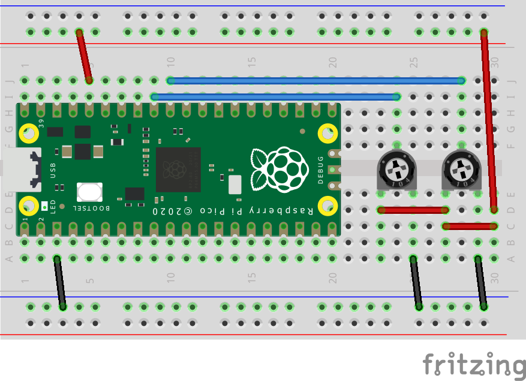

# MIDI2_USB_Toy
MIDI2.0 USB Device experimental implementation, work with Raspberry Pi Pico(RP2040).  
This project was developed with reference to kb-showhey's MIDI2_USB_Dev:  
https://github.com/kb-showhey/MIDI2_USB_Dev

[(日本語はこちら)](#概要)

> [!CAUTION]
> ## This is a proof-of-concept project. No guarantee that it will work.

## Overview
Reads the values of variable resistors connected to ADC0 and ADC1, and sends UMP CC messages.  
Mainly, CPU core 0 handles receiving, while core 1 handles ADC reading and UMP message transmission.  

## Dependencies
- [Pico SDK](https://github.com/raspberrypi/pico-sdk) 2.1.1
- [AM_MIDI2.0Lib](https://github.com/midi2-dev/AM_MIDI2.0Lib)
- [tusb_ump](https://github.com/midi2-dev/tusb_ump)

## How to build
1. Install Visual Studio Code and the Raspberry Pi Pico extension.
2. Open this project folder in Visual Studio Code.
3. If Pico SDK version 2.1.1 is not installed, it will be installed automatically by the extension when you open this project.
4. Open the command palette and run Compile Project task, or use the compile button provided by the Pico extension.
5. To write the firmware to your device, use "Run Project (USB)" or "Flash Project (SWD)" from the Raspberry Pi Pico extension sidebar.

## wiring

## Tested OS
It was recognized as a MIDI 2.0 device on the following operating systems:  
- macOS 15.6.1
- Ubuntu 24.04 (Linux Kernel 6.8.0)
- Windows 11 Insider Preview Build 27934 + MIDI Services Preview13

## 概要
Raspberry Pi Pico(RP2040)で動作するMIDI 2.0 USB コントローラです。  
ADC0とADC1に接続した可変抵抗値を読み取り、UMPのCCメッセージを送信します。  
※Ableton and Max Community Japan #061「MIDIコン開発入門」(https://amcj-061.peatix.com/)のボードが使用できます。  

主にCPUコア0がUSB受信処理を、コア1がADC読み取りとUMPメッセージ送信の処理を担当しています。  
※本プロジェクトはkb-showheyさんの[MIDI2_USB_Dev](https://github.com/kb-showhey/MIDI2_USB_Dev)を参考にさせていただきました

## 依存ライブラリ
- [Pico SDK](https://github.com/raspberrypi/pico-sdk) 2.1.1
- [AM_MIDI2.0Lib](https://github.com/midi2-dev/AM_MIDI2.0Lib)
- [tusb_ump](https://github.com/midi2-dev/tusb_ump)

## ビルド方法
1. Visual Studio Code と Raspberry Pi Pico 拡張機能 をインストールしてください。
2. このプロジェクトフォルダを Visual Studio Code で開きます。
3. Pico SDK バージョン 2.1.1 が未インストールの場合、プロジェクトを開くと必要に応じて Pico拡張機能が自動的にインストールします。
4. コマンドパレットから Compile Project タスクを実行するか、Pico拡張機能のCompileボタンを使用してください。
5. デバイスへの書き込みは、サイドバーの Raspberry Pi Pico 拡張機能から "Run Project(USB)" または "Flash Project(SWD)" を使用してください。

## 動作確認済みOS
以下のOSにおいて、MIDI 2.0デバイスとして認識されました。
- macOS 15.6.1
- Ubuntu 24.04 (Linux Kernel 6.8.0)
- Windows 11 Insider Preview Build 27934 + MIDI Services Preview13
